# Blogging application - ECE Webtech project

Our application is a blog developped using Next.js as a React framework, tailwind CSS and Supabase as our database.
The Blog displays articles about overall web and AI content. As a non user, you can read all our articles. As a user you can write your own articles, and access to a lot of functionalities such as adding comments, likes, modifying your account setting, updating and deleting the articles you have written.

## Production

- Vercel deployment [here](https://ece-webapp-saint-chopin-nicolassaint.vercel.app)
- Supabase project URL : <https://gbycccvvwwhzngmrnpwi.supabase.co>

## Usage

- Clone this repository, from your local machine:

  ```bash
  git clone https://github.com/Nicolassaint/ece-webapp-saint-chopin.git
  ```

- Start the application

  ```bash
  cd Blog-ECE
  # Install dependencies (use yarn or npm)
  npm install
  # Start the front-end
  npm run dev
  ```

  - Start Supabase

  ```bash
  cd Blog-ECE/supabase
  #Start the containers
  docker-compose -f docker-compose.yml -f ./dev/docker-compose.dev.yml up
  ```

## Authors

- Nicolas Saint (nicolas.saint@edu.ece.fr)
- Thomas Chopin (thomas.chopin@edu.ece.fr)

## Tasks

Project management :

- Naming convention

  Graduation : 2/2

  For the naming convention, our variables, files and folders have explicit names.

  - Functions & components begin with a capital letter
  - Pages begin with small letters
  - The code is indented & well spaced

- Project structure

  Graduation: 2/2

  There are 3 main folders:

  - `pages` where we keep all the back-end files
  - `component` where we keep all the component
  - `supabase` where we have our database

  - There's also a folder `Assets` for the README's picture

- Git

  Graduation: 2/2

  We used git to commit and push our changes on a branch `master`. Before, for the labs, we also used branches. Each commit's name uses the conventional commit method and is labbeled with a keyword like `feat:` or `fix:`.

  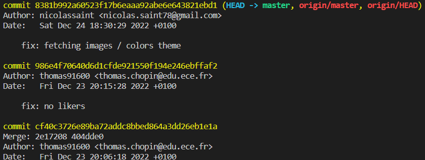

  Conventionnal commit and proper commit history

- Code quality

  Graduation: 4/4

  For the code quality, we used **prettier** to auto indent on save our code in VSCode and several extensions like **markdownlint**.

- Design, UX

  Graduation: 3.5/4

  We did a simple and clean design with a lot of mui & native tailwind components. We also added css styling on the different components.

  As for the UX, we find it enough easy to use and intuitive. Our project is responsive and you can use it on your phone with a drawer that helps the user to use
  well our application on mobile.

  What we could improve:

  - An even better css styling and with animations using
  framer motion

Application development

- Home page

  Graduation : 2/2

  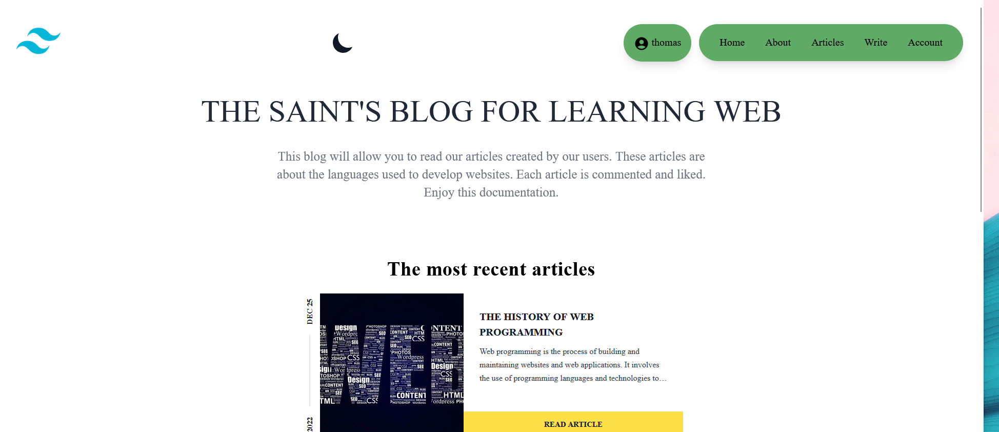

  For the welcome screen, it displays the main functionnalities you can do.

  - On the top left corner you can see our logo.
  - On the top middle of the page, you can use the moon button for dark theme.
  - On the top right , you have our navbar with all functionnalities.
  - On the center of the page you can see the 3 most recent articles.
  - At the bottom you can find our footer that is present
   on each page with our social networks.

  The source code of the welcome page is in [index.js](/Blog-ECE/pages/index.js)

- Login and profile page

  Graduation : 3.5/4

  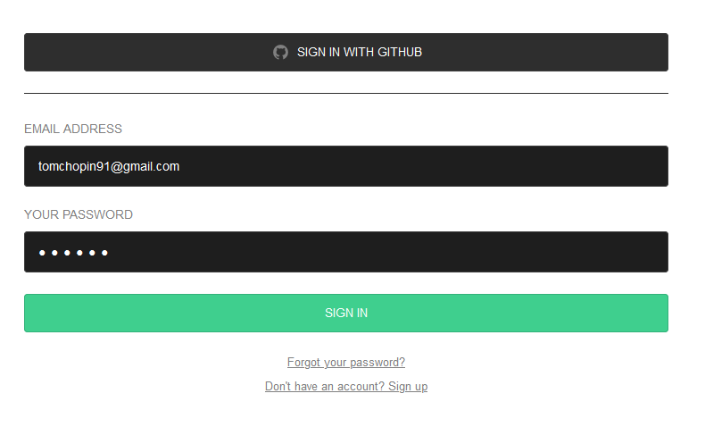

  You can login/logout with this page. This page use Auth component of supabase. You can also signup and create a new account when you receive your verification email.

  You can also sign in with github provider.

  The profile is saved in the database.

  The source code of the login page is in [your_account.js](/Blog-ECE/pages/your_account.js)

  What we could improve :
  - You have to refresh the page
  to see your username in the header after updating your profile, we have this problem only in production, we
  could fix it with more time

- New articles creation

  Graduation : 6/6

  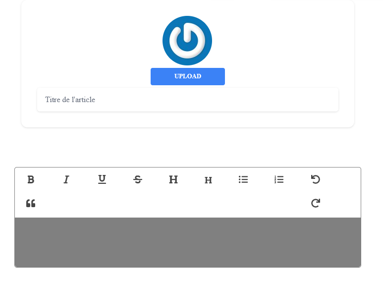

  When you are logged in, a new buton appears in the navbar. you can only create an article if you have an account. To post an article you can upload an image, a tittle and a content. If there is no image there a default image that will appear.

  The source code of this feature is in [write.js](/Blog-ECE/pages/write.js)

- New comment creation

  Graduation : 4/4

  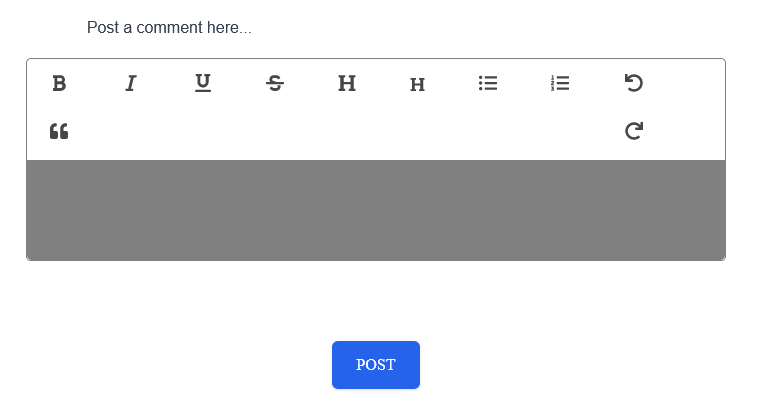

  When you click on the buton `read article`, if you're logged in, you can see at the bottom of the page a WYSIWYG component. You can write your comment and post it on this article. You don't have to refresh the page to
  see it.

  The source code of this feature is in [id.js](/Blog-ECE/pages/articles/[id].js)

- Ressource access control

  Graduation : 6/6

  When a user is not logged, he can see all the articles and comments but can't write any. He can't also like or comment any article.

  When a user is logged, he can access only his articles in his account page for deleting or updating them.
  He can also see an edit & delete button on the comments he wrote on his articles. Those buttons won't appear on comments he didn't write.

- Article modification

  Graduation : 4/4

  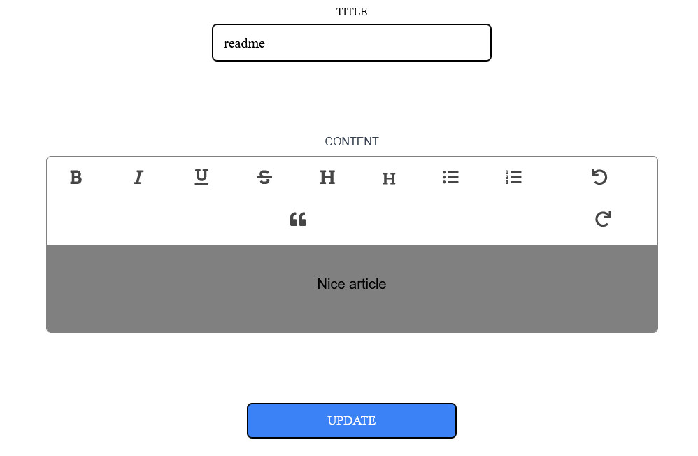

  We can edit an article that we have written. We can change tittle and content of this article using our
  same WYSIWYG component.

  The source code of this feature is in [id.js](/Blog-ECE/pages/updatearticles/[id].js)

- Article removal

  Graduation : 2/2

  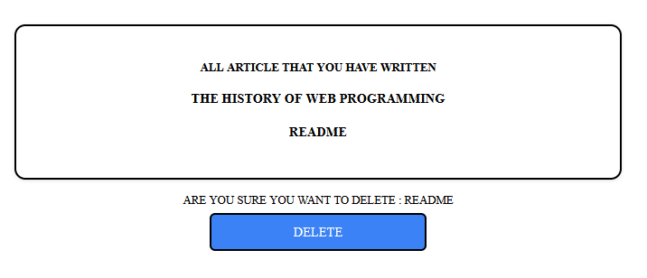

  We can remove an article by clicking on the name.
  You don't have to refresh anything to remove many.

  The source code of this feature is in [deletearticle.js](/Blog-ECE/pages/deletearticle.js)

- Comment modification

  Graduation : 2/2

  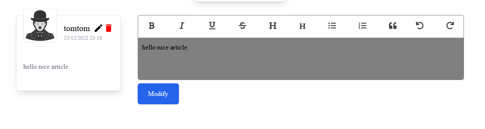

   When you click on the icon `Edit` you can change the content of your comment with our WYSIWYG component.

  The source code of this feature is in [id.js](/Blog-ECE/pages/articles/[id].js)

- Comment removal

  Graduation : 2/2

  When you click on the icon `delete`, you delete your comment without any refresh needed.

  The source code of this feature is in [id.js](/Blog-ECE/pages/articles/[id].js)

- Account settings

  Graduation : 4/4

  

  When you sign in on this application. You can update your profile picture, your username, your website and you can choose your favorite color.
  Choosing a username is needed to write any article or comments.

  Bonus : By default your gravatar is shown as your profile picture, if you want to have a better quality image or another one you can uploead it directly, your gravatar will no longer be shown.

  The source code of this feature is in [your_account.js](/blog-ECE/pages/your_account.js)

- WYSIWYG integration

  Graduation : 2/2

  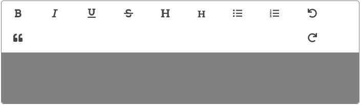

  We use a TipTap fully customed WYSIWYG component to create & modify, articles and comments.

  The source code of this feature is in [Tiptap.jsx](/Blog-ECE/components/editor/Tiptap.jsx)

- Gravatar integration

  Graduation : 2/2

  

  We use a gravatar component to implement this functionality in our pages as explained for instance in our account settings evaluation.

- Light/Dark theme

  Graduation : 2/2

  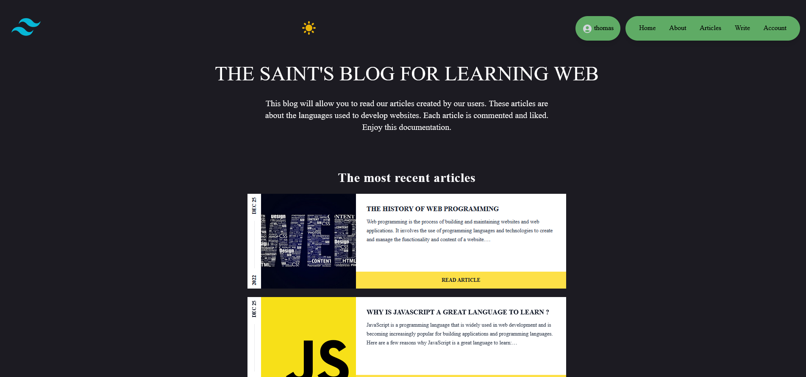

  On each page, in our header there is a moon that change the theme if you click on it. You can choose between dark theme or light theme.

- Accent color selection

  Graduation : 4/4

  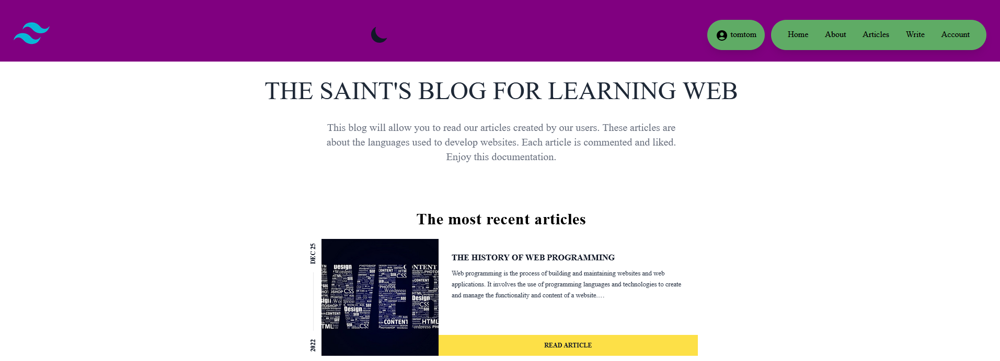

  In account settings page, you can select your favorite color theme. If click on update after picking one, the footer and navbar will change it's color with your favorite picked color. It's our choice to change only the footer and header to keep the UX soul of our website.

  This color is saved in our database.

## Bonus

- Likes :

  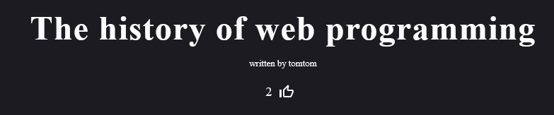

  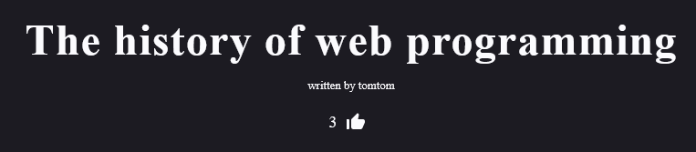

  We implemented likes on articles. This is not just a counter but a well coded like functionality. You can't like two times the same article with the same account.
  If you like an article the thumbUp button will be different showing that you arleady liked the article, if you click again it will withdraw your like and change again the thumbUp button as it is not liked anymore.
  Only logged users can like articles.

  In our database, likes are implemented with an array of users id (uuid) in our article table.

- Profile's picture :

  Gravatar by default and possibilty of choosing a picture from your files to have a better quality image or just another one.

- Responsivness with a custom drawer for mobile users.

  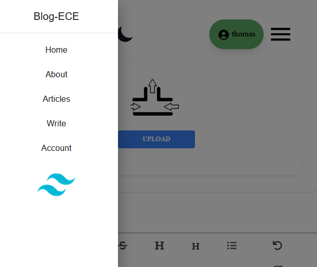
