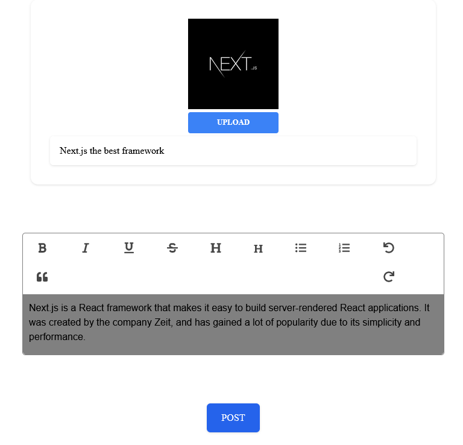
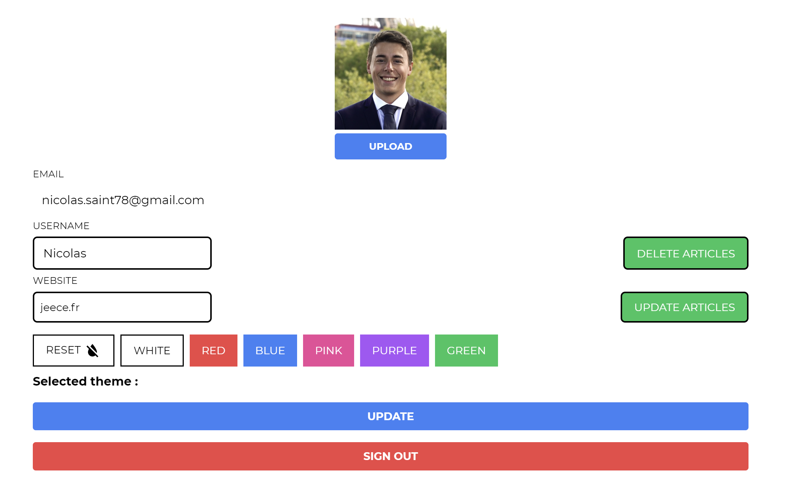

# Blogging application - ECE Webtech project


## Production

- Vercel URL: https://ece-webapp-saint-chopin-nicolassaint.vercel.app
- Supabase project URL: 

## Usage

- Clone this repository, from your local machine:

  ```bash
  git clone https://github.com/Nicolassaint/ece-webapp-saint-chopin.git
  ```

- Start the application

  ```bash
  cd Blog-ECE
  # Install dependencies (use yarn or npm)
  npm install
  # Start the front-end
  npm run dev
  ```

  - Start Supabase

  ```bash
  cd Blog-ECE/supabase
  docker compose up
  ```

## Author

- Nicolas Saint (nicolas.saint@edu.ece.fr)
- Thomas Chopin (thomas.chopin@edu.ece.fr)

## Tasks

Project management :

- Naming convention

  Graduation : 2/2

  For the naming convention, our variables have explicit names and also for our files.

  - Functions begin with a capital letter
  - The code is indented

- Project structure

  Graduation: 2/2

  There are 3 main folders:

  - `pages` where we keep all the back-end files
  - `component` where we keep all the component
  - `supabase` where we have our database

- Git

  Graduation: 2/2

  We used git to commit and push our changes on a branch `master`. Before, for the labs, we also used branches. Each commit's name uses the conventional commit method and is labbeled with a keyword like `feat:` or `fix:`.

  

  Conventionnal commit and proper commit history
  
- Code quality

  Graduation: 4/4

  For the code quality, we used **prettier** to auto indent on save our code in VSCode and several extensions like **markdownlint**.

- Design, UX

  Graduation: 3.5/4

  We did a simple and clean design with a lot of mui components, especially material icons. We also added css styling on the different components.

  As for the UX, we find it enough easy to use and intuitive. Our project is responsive and you can use it on your phone.

  What we could improve:

  - An even better css styling

Application development

- Home page

  Graduation : 2/2

  

  For the welcome screen, it displays the main functionnalities you can do.

  - On the top left corner you can see our logo.
  - On the top middle of the page, you can use the moon button for dark theme.
  - On the top right , you have our navbar with all functionnalities.
  - On the center of the page you can see the 3 most recent articles.

  The source code of the welcome page is in [index.js](/Blog-ECE/pages/index.js)

- Login and profile page

  Graduation : 3.5/4

  

  You can login/logout with this page. This page use Auth component of supabase. You can also signup and create a new account when you receive your verification email.

  You can also sign in with github.

  The profile is saved in the database.

  The source code of the login page is in [your_account.js](/Blog-ECE/pages/your_account.js)

- New articles creation

  Graduation : 6/6

 

  When you are login, a new buton appears in the navbar. you can only create an article if you have an account. To post an article you have to upload an image, a tittle and a content. If there is no image there is an automatic image that is filled in the database.

  The source code of this feature is in [write.js](/Blog-ECE/pages/write.js)

- New comment creation

  Graduation : 4/4

  

  When you click on the buton `read article` you can see at the bottom of this page a WYSIWYG component. You can write your comment and post it on this article. If you are not log this component not appears.

  The source code of this feature is in [id.js](/Blog-ECE/pages/articles/[id].js)

- Ressource access control

  Graduation : 6/6

  When a user is not logged, he can see all the articles and comments but can't write any. He can't also like or comment any article.

  When a user is logged, he can access only his articles in his account for deleting or updating them.
  He can also see an edit / delete button on the comments he wrote on an article. Those buttons won't appear on comments he didn't write.

- Article modification

  Graduation : 4/4

  

  We can edit an article that we have written. We can change tittle and content of this article.

  The source code of this feature is in [id.js](/Blog-ECE/pages/updatearticles/[id].js)

- Article removal

  Graduation : 2/2

  

  We can remove an article by clicking on the name.

  The source code of this feature is in [deletearticle.js](/Blog-ECE/pages/deletearticle.js)

- Comment modification

  Graduation : 2/2

  

  You can only change the content of your comment. When you click on the icon `Edit` you can change the content of your comment.

  The source code of this feature is in [id.js](/Blog-ECE/pages/articles/[id].js)

- Comment removal

  Graduation : 2/2

  You can only delete your comment. When you click on the icon `delete`.

  The source code of this feature is in [id.js](/Blog-ECE/pages/articles/[id].js)

- Account settings

  Graduation : 4/4

 

  When you sign in on this application. You can update your profile picture, your username, your website and you can choose your favorite color.

  The source code of this feature is in [your_account.js](/blog-ECE/pages/your_account.js)

- WYSIWYG integration

  Graduation : 2/2

  We use a component  input to create a comment, modify comment or create article. It's better to use this component to create an article with a real content.

  The source code of this feature is in [tiptap.js](/Blog-ECE/components/editor/Tiptap.jsx)

- Gravatar integration

  Graduation : 2/2

- Light/dar theme

  Graduation : 2/2

  On each page there is a moon or a sun if you click and it it will change the theme. You can choose between dark theme or light theme.

- Accent color selection

  Graduation : 4/4

  In account you can select you favorite color. You click on update, the footer and navbar will change it's color with your favorite color.
  
  This color is saved in our database.

## Bonus

- Like :

  We implemented like on articles. When you like the counter of like up and after you can dislike. You can't like two times the same articles with the same account.
